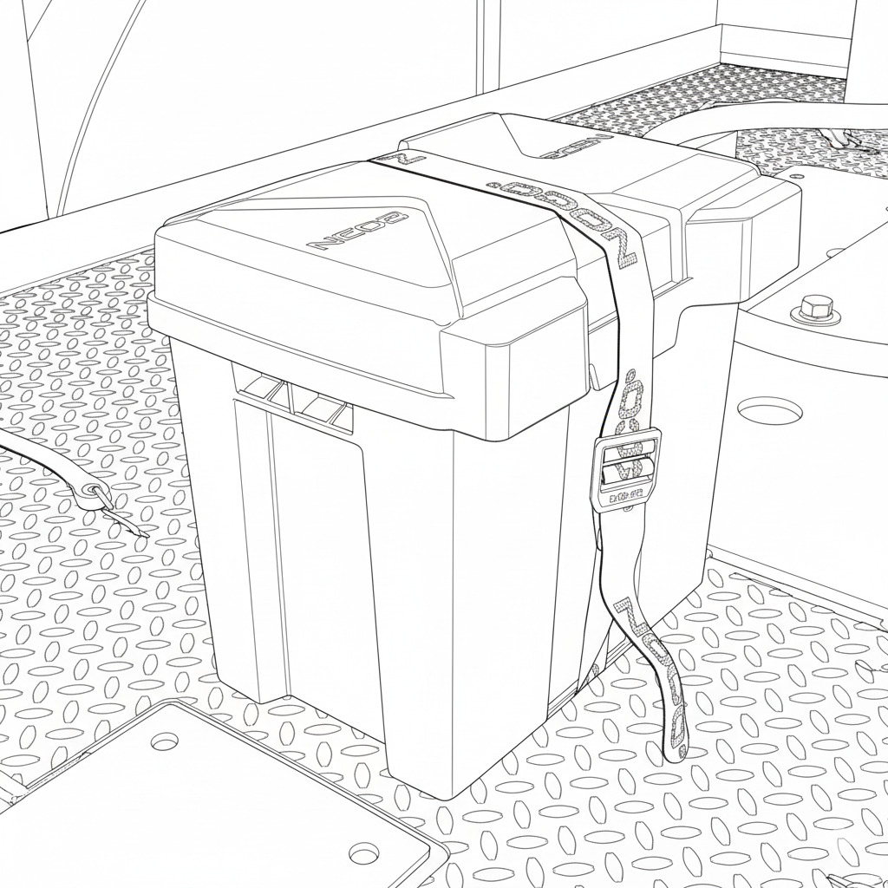

## Local Operation

{: style="height:350px;width:auto"}

Controls for local operation of the gate can be found on the front of the controller enclosure. Unlatch the smaller outer enclosure to reveal the control buttons.

### Lowering the Gate Arm

* Ensure the gate travel path is clear.

* Press the ``DOWN`` arrow button. The roadway lights and bell will activate shortly before the arm begins to move.

* The lights and bell will remain on when the gate is in the down position.

### Raising the Gate Arm

* Ensure the gate travel path is clear.

* Press the ``UP`` arrow button.

* Wait for the arm to stop moving and the roadway lights and bell to turn off.

## Remote Operation

The crossing gate remote and wireless charger are stored in an attached weatherproof enclosure for operator convenience.

{: style="height:350px;width:auto"}

!!! warning "Seal Enclosure"
    Always double-check that the enclosure is closed and the strap is tightly secured to prevent weather damage.

{: style="height:350px;width:auto"}

### Wake Remote

The remote will automatically go into sleep mode after 30 seconds to preserve battery life.

* Press any button to wake the remote.

* Remote will return to sleep mode after 30 seconds if no buttons are pressed.

### Viewing List of Paired Crossings

* Press and hold the ``SET`` button for 2-5 seconds.

* LEDs will flash blue when viewing mode is active.

**Crossings and Crossing Groups**

The Portable Crossing Gate System allows for the programming and control of multiple crossing groups using the remote.

* In viewing mode, the top row of LEDs indicates the active group, while the bottom row indicates the number of crossings in that group.

* Use the arrow buttons to cycle through groups.

* Crossings are listed in binary, with the number of the group and crossing indicated by the number of illuminated LEDs.

### Pairing a crossing

* Hold the ``UP`` arrow button to enter teach mode.

* The LEDs will flash yellow 3-4 times to indicate teach mode is active.

* With the remote in teach mode, bring it next to the local controller on the crossing you want to pair.

* Press the small pairing button on the bottom right corner of the local controller to send a pairing signal.

* When the crossing is paired, the remote LEDs will flash yellow.

!!! note "Grouping"
    Ensure that opposing crossings are paired in the same group.

    

### Lowering the Gate Arm

* Ensure the gate travel path is clear.

* Ensure the correct crossing gate/group is selected.

* Press any button once to wake the remote.

* Press the ``DOWN`` arrow button. The roadway lights and bell will activate shortly before the arm begins to move.

* The lights and bell will remain on when the gate is in the down position.

### Raising the Gate Arm

* Ensure the gate travel path is clear.

* Ensure the correct crossing gate/group is selected.

* Press any button once to wake the remote.

* Press the ``UP`` arrow button.

* Wait for arm to stop moving and the roadway lights and bell to turn off.

