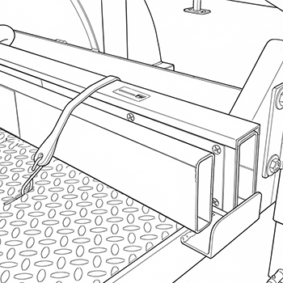
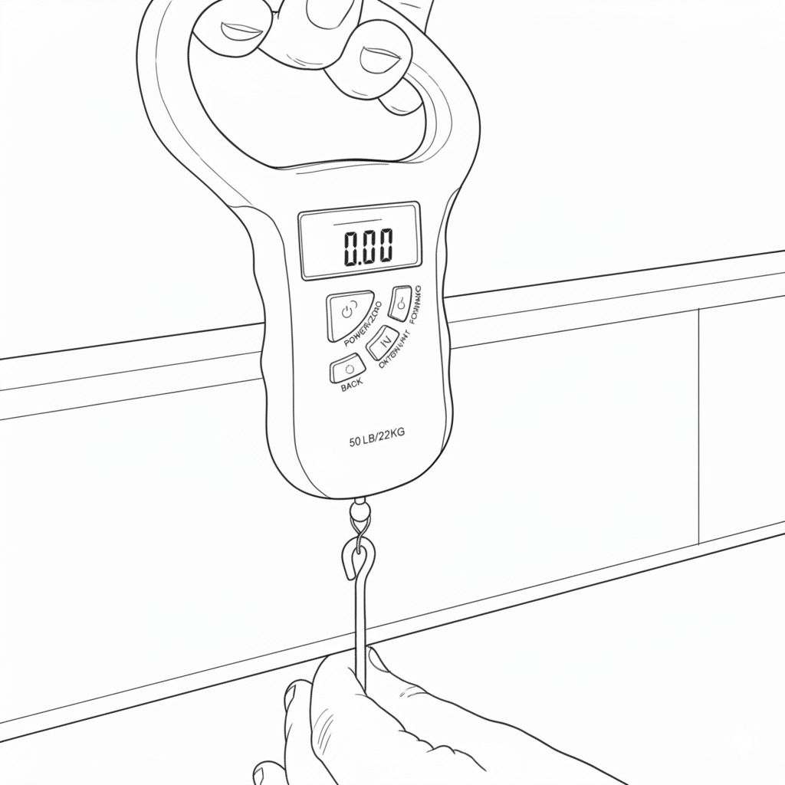
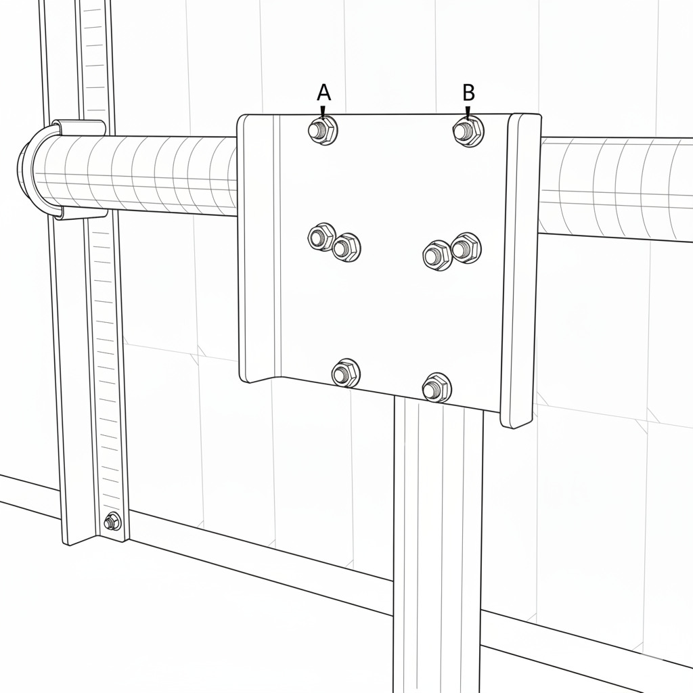
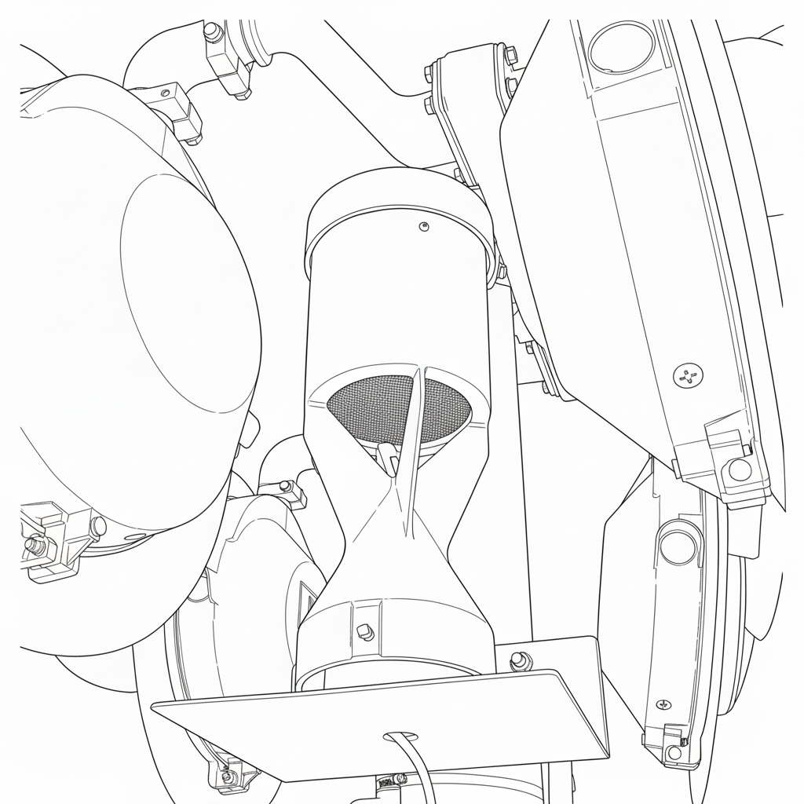
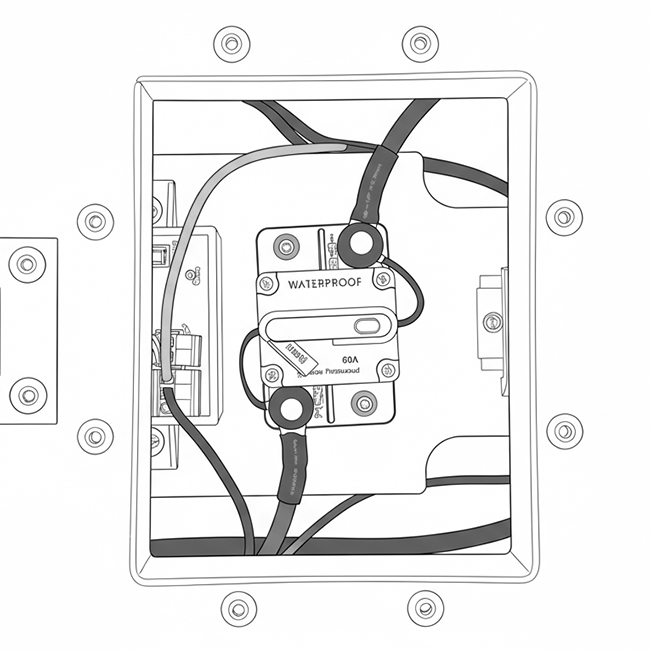

## Safety

!!! caution "Disclaimer"
    Always ensure you have the correct tools and training before beginning installation.  

Attempting installation without the specified tools may result in improper assembly, equipment damage, or injury.  

Before beginning installation, confirm that all required tools and components are available.  
Site preparation must be completed before installing the derail system.  

### Personal Protective Equipment (PPE)

!!! warning "PPE Advisory"
    All required personal protective equipment must be equipped before transport, maintenance, or assembly.

* Hard Hat  

* Earplugs or Earmuffs

* Safety Glasses

* Gloves  

* Steel Toe Footwear  

* High Visibility Clothing

### Tools and Equipment

* Measuring Tape

* Tamping Pick or Pickaxe

* Multimeter

* Metric Allen Key Set

* Adjustable Wrench x2

* 1/8" Slotted Screwdriver

* Level (Bubble or Digital)

* Digital Hanging Scale/Fish Scale (Reccomend 60+ Lbs. rating)

## Towing

!!! caution "Towing Advisory"
    The trailer is not registered for towing on public roads. The Portable Crossing Guard must be transported via flatbed when traversing public roads.  

* Follow the procedure described in the **Maintenance** section titled "Before Storage or Transport".

## Site Preparation

### Check Clearance

Before finalizing trailer placement or beginning system operation, verify that all mounted components — particularly the arm assembly and sign structure — have adequate clearance in their intended orientation and operating range.

**Step 1: Verify Arm Orientation**

* Confirm that the arm assembly is installed facing the correct direction relative to the trailer frame.

* The pivot or hinge side should align with the mounting reference point specified in the assembly drawing.

* Ensure there are no obstructions above or beside the arm that could interfere with its full range of motion.

**Step 2: Check Sign Orientation**

* The sign face should be perpendicular to the direction of approaching traffic or as required by the installation plan.

* Verify that the top and bottom edges are parallel to the trailer deck once the trailer is fully leveled.

* If applicable, confirm that the sign conforms to MUTCD visibility and height requirements. The lower edge of the sign should typically be at least 7 ft (2.1 m) above the ground surface in pedestrian areas, or as required by local code.

**Step 3: Measure Operational Clearance**

* With the arm extended to its full working position, measure the horizontal and vertical clearances around the structure.

* Maintain a minimum of 12 in (305 mm) of clearance from any moving or rotating component to nearby surfaces, fixtures, or cables.

* If operating near buildings or trees, confirm that the arm and sign have unrestricted motion through their full intended range.

**Step 4: Lock and Secure**

* After verifying clearances, tighten all pivot bolts, clamps, or lock pins to manufacturer specifications.

* Confirm that no cables or hoses are under tension or pinched during movement of the arm or sign.

### Check Levelness

**Step 1: Inspect the Ground Surface**

* Choose a compact, load-bearing surface such as concrete, asphalt, or well-compacted gravel.

* Avoid locations with loose soil, soft clay, grass, or sand, as these may settle unevenly under the trailer’s weight.

* Ensure there are no depressions, mounds, or large stones beneath the jack points. These can cause twisting of the frame or difficulty in leveling.

**Step 2: Assess Surface Drainage**

* Select an area with good runoff so water will not pool under or around the trailer.

* Avoid low-lying areas that retain moisture, which can cause the trailer to settle into the ground.

**Step 3: Check for Slope and Elevation**

!!! Caution "Levelness"
    Operating the trailer on an uneven or unstable surface can result in frame misalignment, inaccurate leveling, or equipment damage.

* Use a bubble level or laser level to check the surface in both directions.

* The surface should not vary by more than **½ inch** over the length of the trailer (12 ft) or **¼ inch** across the width (8 ft).

* If the variation exceeds these limits, adjust by relocating the trailer or using leveling pads under the jacks.

**Step 4: Prepare the Contact Area**

* Clear debris, gravel clusters, or vegetation from under each jack location.

* If the surface is uneven, place solid wooden or composite blocks beneath the jacks to distribute load evenly.

* Never use rocks, bricks, or cinder blocks, as they may fracture under pressure.

### Determine Solar Angle

* For optimal charging performance, the solar panel must receive unobstructed, direct sunlight between **10:00 AM and 3:00 PM**.

* Ensure there is no shading from nearby structures, railcars, vegetation, or other equipment during these hours.

* Controller enclosure may be moved along battery enclosure rails to allow clearance for the solar panel.

* If the site receives limited sunlight or experiences partial shading, a second solar panel may be installed to maintain adequate system charging capacity.

**Step 1: Determine Panel Direction**

* For installations north of the Equator, the solar panel should face **south** for optimal efficiency.

* Observe the site and ensure that the solar panel will receive sun once installed.

* Two locations with **1/4"-20** threaded stud patterns are provided for mounting the solar panel and light assemblies.

* The solar panel must be mounted on the stud pattern closest to the side of the device that will receive the most sunlight.  

**Step 1: Measure Tilt Angle**

The optimal tilt angle for solar panel efficiency depends on the latitude of the installation site.

* Use a maps or GPS app to measure the site latitude.

* Set the tilt angle equal to the latitude.

!!! example
    Latitude = 38.2° → Tilt angle = **38.2°**

**Step 2: Seasonal adjustments:**

* Winter = **Latitude + 15°**  

* Summer = **Latitude – 15°**  

* Spring/Fall = **Latitude only**  

!!! example
    Spring/Fall tilt angle = **38.2°**  
    Winter tilt angle = 38.2° + 15° = **53.2°**  
    Summer tilt angle = 38.2° – 15° = **23.2°**  

### Leveling the Trailer

{: style="height:350px;width:auto"}

The trailer is equipped with four corner-mounted leveling jacks, one at each corner of the frame. These jacks are used to stabilize and level the trailer after it has been positioned at the installation site.

!!! warning "Level with Corner Jacks Only"
    Do not use the fifth-wheel jack (tongue jack) to support or level the trailer.
    The fifth-wheel jack is intended only for hitching and towing. Using it for leveling may cause frame distortion or unsafe loading.

**Step 1: Preparing to Level**

* Inspect the ground. Verify that the surface beneath each jack is firm, flat, and load-bearing. If the site is gravel or soil, place a concrete paver, composite pad, or steel plate beneath each jack foot to prevent sinking or shifting.

* Check jack condition. Ensure each jack is free of rust, bends, or mechanical damage. Confirm that all mounting bolts are tight and that the jack threads or screw mechanisms move smoothly.

* Confirm travel range. Each jack must have sufficient travel to raise the trailer until the wheels are just off the ground. This ensures all load weight is transferred to the jacks for accurate leveling.

**Step 2: Leveling Procedure**

* Park the trailer in the desired position and set the wheel chocks to prevent rolling.

* Disconnect the trailer from the towing vehicle if necessary.

* Lower the corner jacks, starting with the rear jacks to stabilize the frame.

* Lower each jack until it makes firm contact with the ground or paver.

* Then lower the front jacks, adjusting each incrementally.

**Step 3: Adjust to Level**

* Place a bubble or digital level on the trailer frame or deck.

* Adjust opposing jacks (A–C and B–D, see Figure 4-1) in small increments until the trailer is level front-to-back and side-to-side.

* Continue fine adjustments until the trailer frame is fully level and stable, and all four jacks share the load evenly.

**Step 4: Verify Clearance and Levelness**

* Ensure the wheels are off the ground and the jack arms are extended within safe limits.

* Check that arm, lights, and crossbuck meet MUTCD height requirements relative to roadway.

* The trailer must remain stationary and rigid when moderate force is applied to any corner.

## Setup

!!! warning "Levelness"
    Trailer leveling must be complete before proceeding with setup.
    
!!! warning "Weather"
    Before beginning trailer setup, check weather forecast. Do not attempt setup in high winds or lighting.

### Crossing Arm Setup

!!! tip
    Refer to the Western Cullen Hayes service and Installation manual for detailed arm installation and counterweighting instructions.

Multiple arm sections are provided for installations requiring specific arm lengths. Two metal sections are included, two middle sections, and one end section. Refer to the following table to determine the correct arm setup procedure for your specific installation length.

**5'-8':** 6' metal section + 4' end section.

**8'-22':** 8' metal section + 8' middle section + 8' end section.

**Step 1: Unload the Arm Sections**

{: style="height:350px;width:auto"}

* Locate the crossing arm sections in the holders on the left and right sides of the trailer.

* Remove the rubber tie straps securing the arm sections and lift sections upward to remove.

**Step 2: Assemble the Crossing Arm**

* Install the arm sections in sequential order. Use only the sections needed for the installation length.

* Allow telescoping sections to overlap by at least 1'.

**Step 3: Secure the Crossing Arm**

* Verify that telescoping arm sections overlap by at least 12".

* Drill a 3/8" holes through each of the overlapping sections, 8" away from the end of each section per the diagram.

* Remove any metal or fiberglass shavings from the drilled holes.

* Insert provided 3/8" bolts, washers, and nuts to secure the arm.

* Snug arm bolts with a wrench, do not overtighten.

### Counterweight Setup

!!! warning "Counterweight Warning"
    Do not apply counterweight before the roadway gate arm is installed

!!! caution "Counterweight Blocker Plate"
    Do not remove the pre-installed counterweight blocker plate when installing the counterweights.
    Doing so may result in damage to equipment from improperly placed counterweights.

**Step 1: Apply Initial Counterweight**

* Remove the counterweight retaining nuts.

* Place one counterweight on each side of the crossing arm.

**Step 2: Weigh the Arm**

{: style="height:350px;width:auto"}

* Using a digital hanging scale/fish scale, weigh the arm in its final installed configuration.

* Refer to the counterweight tables in the W.C. Hayes 3590 Series OEM manual.

* Add or remove counterweight plates, checking with scale until proper weight is reached for arm length.

**Step 3: Secure Counterweight**

* Add counterweight retaining nuts and washers to secure plates. Tighten til snug, do not overtighten.

* Stow unused counterweights in counterweight holder.

### Solar Panel Setup

**Step 1: Set Solar Panel Rotation**

* Remove the banding straps holding the solar panel in place.

* Loosen the solar panel pipe receiver bolts and rotate the panel to the desired direction.

* Tighten the pipe reciever bolts to lock the solar panel rotation.

**Step 2: Set Solar Panel Inclination**

{: style="height:350px;width:auto"}

* Loosen the U-bolt nuts labeled **A** and **B** and rotate the panel to the desired inclination.

* Tighten U-bolt nuts **A** and **B** to lock the solar panel inclination.

* Snug U-bolts with a wrench so that the solar panel will not fall out of postion. Do not overtighten nuts.

### Roadway Lights Setup

!!! caution "Roadway Lights Orientation" 
    The direction of the roadway lights are set by the manufacturer, please return to TXRX for reconfiguration or contact a TXRX representative for on-site instructions.

### Bell Setup

!!! caution "Bell Orientation" 
    The direction of the bell is set by the manufacturer, please return to TXRX for reconfiguration or contact a TXRX representative for on-site instructions.

{: style="height:350px;width:auto"}

* Refer to Western Cullen Hayes manual for detailed bell instructions.

### Crossbuck and Antenna Setup

* Locate the cable pulley and handle attached to the crossbuck assembly.

* Pull on the turnbuckle to raise the crossbuck and antenna array to 90 degrees.

{: style="height:350px;width:auto"}

* Hook the turnbuckle to the retaining plate.

* Secure the mechanism by tightening the turnbuckle until all slack is removed from the cable.

## Electrical

### Addressing the Crossing

Within the controller enclosure, an array of DIP switches are visible. These switches set the address of the crossing. 

* The DIP switches use binary addressing to allow one remote to be used with multiple crossing systems.

* Each crossing in an installation must use a unique address.

### Connecting the Solar Panel

* Connect solar jack on battery to solar plug attached to panel.

* If using two panels, use the provided Y-splitter to connect both panels to the battery input.

* Ensure all connections are secure and fully seated.

### Connecting the Lights

Emergency disconnect is under hatch on battery box.

{: style="height:350px;width:auto"}

## Software

### Connecting the Remote

